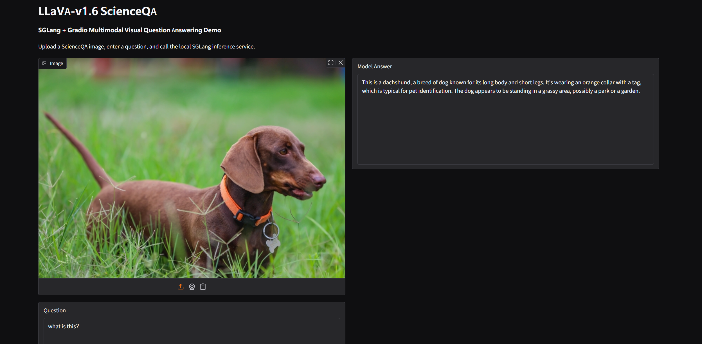

# LLaVA ScienceQA LoRA Fine-Tuning & SGLang Deployment

End-to-end **LoRA fine-tuning, evaluation, and deployment pipeline** for **LLaVA-v1.6-Vicuna-7B** on the image-based subset of **ScienceQA**.

```text
ScienceQA
    ↓
Data Conversion
    ↓
LLaVA-v1.6-Vicuna-7B
    ↓
LoRA Fine-Tuning
    ↓
Base vs. LoRA Evaluation
    ↓
LoRA Merge
    ↓
SGLang Inference Server
    ↓
OpenAI-Compatible API
    ↓
Gradio Web Demo
```

### Result

| Model                     |         Correct |   Accuracy |
| ------------------------- | --------------: | ---------: |
| LLaVA-v1.6-Vicuna-7B Base |     1136 / 2017 |     56.32% |
| **Best ScienceQA LoRA**   | **1414 / 2017** | **70.10%** |

**Absolute improvement: +13.78 percentage points**

---

## Repository Structure

This repository contains only the project-specific scripts and demo. The complete LLaVA source code, model weights, datasets, and checkpoints are not included.

```text
.
├── scripts/
│   ├── convert_scienceqa.py
│   ├── eval_scienceqa_official.py
│   ├── finetune_lora.sh
│   └── merge_lora_weights.py
│
├── gradio_llava_scienceqa.py
├── 215927.png
└── README.md
```

| File                                 | Purpose                                                                                            |
| ------------------------------------ | -------------------------------------------------------------------------------------------------- |
| `scripts/convert_scienceqa.py`       | Filter image-based ScienceQA samples, export images, and convert data to LLaVA conversation format |
| `scripts/finetune_lora.sh`           | LoRA fine-tuning configuration and launch script                                                   |
| `scripts/eval_scienceqa_official.py` | Controlled Base / LoRA evaluation on ScienceQA                                                     |
| `scripts/merge_lora_weights.py`      | Merge the trained LoRA adapter into the LLaVA base model                                           |
| `gradio_llava_scienceqa.py`          | Gradio frontend for the SGLang multimodal API                                                      |
| `215927.png`                         | Gradio Web Demo screenshot                                                                         |

---

# 1. Environment

Training and deployment use **two separate Conda environments** to isolate the original LLaVA training dependencies from the newer SGLang inference stack.

## 1.1 Training Environment — `llava`

Used for:

```text
Data Processing
LoRA Fine-Tuning
Evaluation
LoRA Merge
```

Verified environment:

```text
GPU             NVIDIA RTX 4090 24GB
Python          3.11.15
CUDA Toolkit    12.1 (V12.1.105)
PyTorch         2.1.2+cu121
Transformers    4.37.2
Accelerate      0.21.0
PEFT            0.4.0
DeepSpeed       0.12.6
FlashAttention  2.5.9.post1
```

Base model:

```text
LLaVA-v1.6-Vicuna-7B
```

Vision tower:

```text
openai/clip-vit-large-patch14-336
```

Clone and install the official LLaVA repository:

```bash
git clone https://github.com/haotian-liu/LLaVA.git
cd LLaVA

conda create -n llava python=3.11
conda activate llava

pip install -e .
pip install -e ".[train]"
pip install flash-attn --no-build-isolation
```

The scripts in this repository are designed to work with the official LLaVA implementation.

---

## 1.2 Deployment Environment — `sglang-deploy`

SGLang and Gradio run in a **separate Conda environment** to avoid dependency conflicts with the LLaVA training stack.

Verified environment:

```text
GPU             NVIDIA RTX 4090 24GB
Python          3.12.13
CUDA Toolkit    13.0 (V13.0.88)
PyTorch         2.13.0+cu130
Transformers    5.12.1
SGLang          0.5.18
Gradio          6.25.0
Requests        2.34.2
```

The two environments are connected through the merged model:

```text
llava
├── Data Processing
├── LoRA Fine-Tuning
├── Evaluation
└── LoRA Merge
        │
        │ Merged Model
        ▼
sglang-deploy
├── SGLang Inference Server
├── OpenAI-Compatible API
└── Gradio Web Demo
```

Create the deployment environment:

```bash
conda create -n sglang-deploy python=3.12
conda activate sglang-deploy
```

---

# 2. ScienceQA Data Preparation

ScienceQA contains both image-based and text-only questions.

Since this project focuses on multimodal VQA, only samples containing images are retained.

```text
Original Train: 12726
Image Train:     6218

Original Test:   4241
Image Test:      2017
```

Run:

```bash
python scripts/convert_scienceqa.py
```

Processing pipeline:

```text
ScienceQA Parquet
        ↓
Filter image != None
        ↓
Export Image Bytes
        ↓
Question + Choices
        ↓
LLaVA Conversation Format
```

Example:

```json
{
  "id": "train_000000",
  "image": "train_000000.png",
  "conversations": [
    {
      "from": "human",
      "value": "<image>\nWhich of these states is farthest north?\nA. West Virginia\nB. Louisiana\nC. Arizona\nD. Oklahoma"
    },
    {
      "from": "gpt",
      "value": "A. West Virginia"
    }
  ]
}
```

Generated data:

```text
scienceqa_train_llava.json    6218 samples
scienceqa_test_llava.json     2017 samples
```

---

# 3. LoRA Fine-Tuning

The project performs downstream LoRA adaptation on the pretrained LLaVA model without repeating Stage-1 visual-language alignment.

```text
CLIP Vision Encoder     Frozen
        ↓
MM Projector            Frozen
        ↓
Vicuna LLM
 └── LoRA Adapters      Trainable
```

LoRA target modules:

```text
q_proj
k_proj
v_proj
o_proj
gate_proj
up_proj
down_proj
```

Best configuration:

```text
LoRA Rank              64
LoRA Alpha             128
LoRA Dropout           0.05
Learning Rate          2e-5
Warmup Ratio           0.10
Epochs                  2
```

Training also uses:

```text
BF16
Gradient Accumulation
Gradient Checkpointing
FlashAttention 2
DeepSpeed ZeRO-2
```

Configure the model and dataset paths in:

```text
scripts/finetune_lora.sh
```

Then launch training:

```bash
conda activate llava
bash scripts/finetune_lora.sh
```

---

# 4. Evaluation

Evaluation is implemented in:

```text
scripts/eval_scienceqa_official.py
```

Base and LoRA models use the same:

```text
2017 Image Test Samples
Images
Prompts
LLaVA-v1.6 AnyRes Processing
Conversation Template
Generation Configuration
Answer Parsing
```

The only experimental variable is the model:

```text
LLaVA Base
    vs.
LLaVA Base + ScienceQA LoRA
```

Run:

```bash
conda activate llava
python scripts/eval_scienceqa_official.py
```

### Evaluation Results

```text
Base
Correct:   1136 / 2017
Accuracy:  56.3213%

Best LoRA
Correct:   1414 / 2017
Failed:    0
Accuracy:  70.1041%

Absolute Improvement:
+13.78 percentage points

Relative Improvement:
~24.47%
```

---

# 5. Merge LoRA Weights

After fine-tuning, the LoRA adapter is merged into the original LLaVA model for deployment.

```text
LLaVA-v1.6-Vicuna-7B
          +
ScienceQA LoRA Adapter
          ↓
      LoRA Merge
          ↓
   Merged LLaVA Model
```

Configure the model paths in:

```text
scripts/merge_lora_weights.py
```

Run:

```bash
conda activate llava
python scripts/merge_lora_weights.py
```

The resulting merged model is used directly by the SGLang deployment environment.

---

# 6. SGLang Deployment

Switch from the training environment to the independent deployment environment:

```bash
conda activate sglang-deploy
```

Launch the merged LLaVA model with SGLang:

```bash
python -m sglang.launch_server \
    --model-path /path/to/merged-model \
    --tokenizer-path llava-hf/llava-1.5-7b-hf \
    --chat-template vicuna_v1.1 \
    --host 0.0.0.0 \
    --port 30000
```

Check whether the inference server is running:

```bash
curl http://127.0.0.1:30000/v1/models
```

The deployed model exposes an OpenAI-compatible multimodal endpoint:

```text
POST /v1/chat/completions
```

Inference pipeline:

```text
Image + Prompt
      ↓
OpenAI-Compatible Request
      ↓
SGLang :30000
      ↓
CLIP Vision Encoder
      ↓
MM Projector
      ↓
Vicuna LLM
      ↓
Response
```

---

# 7. Gradio Web Demo

The Gradio frontend is implemented in:

```text
gradio_llava_scienceqa.py
```

Gradio does **not** load the LLaVA model directly. It sends image and text requests to the SGLang inference server.

```text
Browser
   ↓
Gradio :6006
   ↓
Image → Base64
   ↓
POST /v1/chat/completions
   ↓
SGLang :30000
   ↓
LLaVA
   ↓
Response
```

Make sure the SGLang server is running first, then launch Gradio:

```bash
conda activate sglang-deploy
python gradio_llava_scienceqa.py
```

Default services:

```text
SGLang API
http://127.0.0.1:30000

Gradio
0.0.0.0:6006
```

### Demo



---

# Final Workflow

```text
                    llava
                      │
                      ▼
              ScienceQA Dataset
                      │
                      ▼
           convert_scienceqa.py
                      │
                      ▼
             finetune_lora.sh
                      │
                      ▼
      eval_scienceqa_official.py
                      │
                      ▼
       merge_lora_weights.py
                      │
                Merged Model
                      │
──────────────────────┼──────────────────────
                      │
                      ▼
                sglang-deploy
                      │
                      ▼
                SGLang :30000
                      │
                      ▼
          OpenAI-Compatible API
                      │
                      ▼
       gradio_llava_scienceqa.py
                      │
                      ▼
               Gradio :6006
```

**Final ScienceQA Image Test Accuracy: 56.32% → 70.10% (+13.78 pp)**
